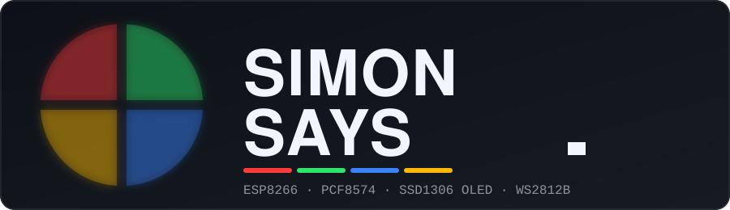
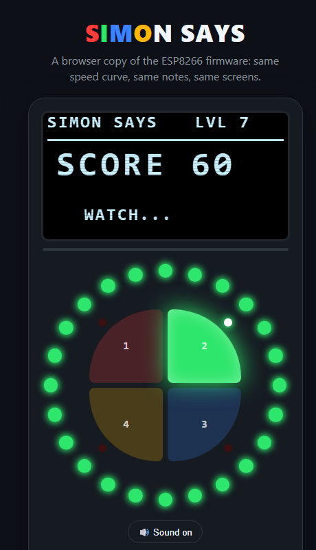
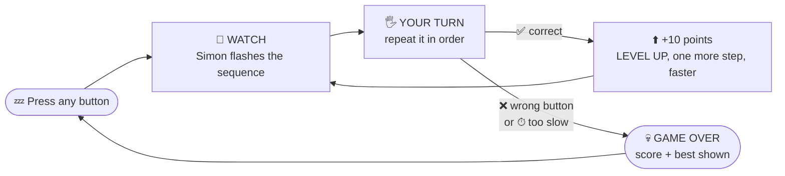
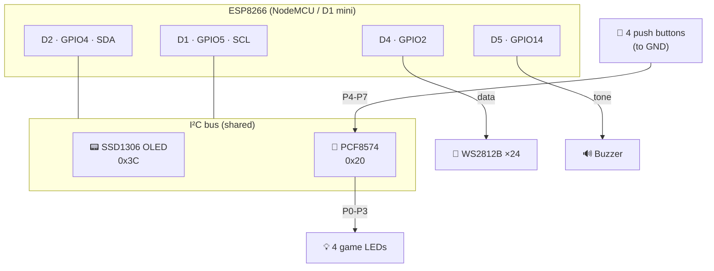
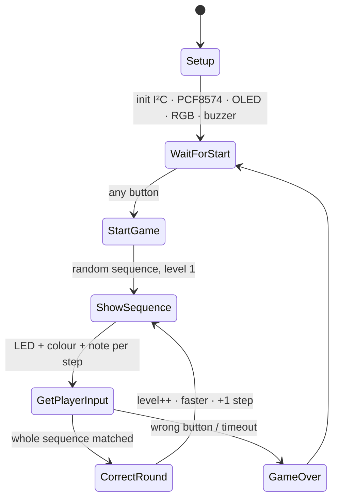

<div align="center">



### 🔴 🟢 🔵 🟡 &nbsp; Watch. Remember. Repeat. &nbsp; 🟡 🔵 🟢 🔴

**A memory game for the ESP8266** with a 24-LED WS2812B ring, an OLED scoreboard,
four glowing push buttons and a buzzer that plays a different note for every colour.


[🕹 Try it now](#-try-it-in-your-browser) ·
[🎮 Play](#-how-to-play) ·
[🔌 Build it](#-hardware) ·
[🚀 Flash it](#-get-it-running) ·
[🧪 Test it](#-hardware-tests) ·
[🩺 Fix it](#-troubleshooting)

</div>

---

## 🕹 Try it in your browser

No board yet? **Play the real game logic right here** — it's a faithful browser port of the firmware
(same speed curve, same notes, same OLED screens, same 24-LED ring).

<div align="center">

<a href="https://htmlpreview.github.io/?https://github.com/Am4l-babu/simon-says/blob/main/docs/simulator.html">
  
</a>

### [▶️ &nbsp;PLAY THE SIMULATOR](https://htmlpreview.github.io/?https://github.com/Am4l-babu/simon-says/blob/main/docs/simulator.html)

<sub>Keys <kbd>1</kbd> <kbd>2</kbd> <kbd>3</kbd> <kbd>4</kbd> or tap the pads · sound on by default · or just open <a href="docs/simulator.html"><code>docs/simulator.html</code></a> locally, no install needed</sub>

</div>

<details>
<summary><b>⚡ Or go straight to the hardware — the 60-second version</b></summary>

```bash
git clone https://github.com/Am4l-babu/simon-says.git
cd simon-says
pio run -e simon_says -t upload      # flash the game
pio device monitor                   # watch the sequences (115200 baud)
```

Prefer the Arduino IDE? Open [`arduino/SimonSays/SimonSays.ino`](arduino/SimonSays/SimonSays.ino) — [details below](#-get-it-running).

</details>

---

## ✨ What is this?

Simon lights up a colour and plays a note. You repeat it. Simon adds one more step. You repeat *all* of them.
Miss one, or think too long, and it's **game over**.

| | Feature |
|---|---|
| 🌈 | **24× WS2812B** ring flashes the whole colour of each step (red · green · blue · yellow) |
| 🔘 | **4 push buttons + 4 LEDs** on a single **PCF8574** I²C expander — only 2 GPIOs used |
| 📟 | **128×64 OLED** shows level, score and best score |
| 🔊 | **Passive buzzer** — a C · E · G · C note per button, plus win/lose jingles |
| ⚡ | Gets **faster** every level (600 ms → 180 ms per step) but gives you **more time** to answer |
| 🧠 | Up to **50 steps** long, fresh random sequence every game |
| 🕹 | **Playable browser simulator** — try the game before you build a single wire |
| 🧪 | **Three stand-alone hardware tests** so you can debug each part on its own |
| 🧰 | Works in **Arduino IDE** *and* **PlatformIO / VS Code** |

---

## 🎮 How to play



<details>
<summary><b>📈 Click to see how the difficulty ramps up</b></summary>

<br/>

| Level | Steps to remember | Time per step shown | Time you get per press |
|:-----:|:-----------------:|:-------------------:|:----------------------:|
| 1  | 1  | 600 ms | 5.0 s |
| 5  | 5  | 480 ms | 5.6 s |
| 10 | 10 | 330 ms | 6.4 s |
| 15 | 15 | **180 ms** (max speed) | 7.1 s |
| 20 | 20 | 180 ms | 7.9 s |
| 50 | 50 (max length) | 180 ms | 10.1 s |

* Every correct round is worth **10 points**.
* The press timer **resets after every button**, so it's "time to think", not "time to finish".
* The best score lives in RAM only — it resets when you power-cycle the board.

</details>

<details>
<summary><b>🔔 Click to see what every colour sounds like</b></summary>

<br/>

| Button | Colour | Note | Frequency |
|:------:|:------:|:----:|:---------:|
| 1 | 🔴 Red    | C  | 262 Hz |
| 2 | 🟢 Green  | E  | 330 Hz |
| 3 | 🔵 Blue   | G  | 392 Hz |
| 4 | 🟡 Yellow | C↑ | 523 Hz |

Correct round → 700 Hz beep · Level up → 800 Hz then 1000 Hz · Game over → two low growls (150 Hz, 100 Hz).

</details>

---

## 🔌 Hardware

### Bill of materials

| Qty | Part | Notes |
|:---:|------|-------|
| 1 | **ESP8266 board** | NodeMCU v2 / v3 or Wemos D1 mini (pin labels D1, D2, D4, D5 are the same) |
| 1 | **PCF8574** I²C I/O expander module | address **0x20** (A0 = A1 = A2 = GND) |
| 1 | **SSD1306 OLED 128×64**, I²C | address **0x3C** |
| 1 | **WS2812B ring / strip** | code assumes **24** LEDs — see [customising](#-make-it-yours) |
| 4 | Push buttons | one side to **GND**, the other to PCF8574 P4–P7 |
| 4 | LEDs + resistors | on PCF8574 P0–P3 (driven **active HIGH** by the code) |
| 1 | Passive buzzer | on D5 |
| — | 5 V supply, wires, breadboard | the LED ring needs its own 5 V and a common GND |

### Pin map

<table>
<tr><td>

**ESP8266**

| Signal | Pin | GPIO |
|--------|:---:|:----:|
| I²C SDA | D2 | 4 |
| I²C SCL | D1 | 5 |
| WS2812B data | D4 | 2 |
| Buzzer | D5 | 14 |

</td><td>

**PCF8574 (0x20)**

| Pin | Use |
|:---:|-----|
| P0 | LED 1 🔴 |
| P1 | LED 2 🟢 |
| P2 | LED 3 🔵 |
| P3 | LED 4 🟡 |
| P4 | Button 1 |
| P5 | Button 2 |
| P6 | Button 3 |
| P7 | Button 4 |

</td></tr>
</table>

### Wiring overview



> [!IMPORTANT]
> * Give the **LED ring its own 5 V** feed and join its **GND** to the ESP8266's GND. At brightness 80/255 a full-white ring of 24 pixels can pull **≈ 0.45 A** — don't power it from the ESP's 3.3 V pin.
> * The OLED and PCF8574 both run from **3.3 V** here. I²C pull-ups (4.7 kΩ) are already present on most breakout modules.
> * The PCF8574 buttons need no external pull-ups: the chip's quasi-bidirectional pins idle high, and a pressed button pulls the pin to GND (**active LOW**).

---

## 📁 Project structure

```text
simon_says/
├── 📄 README.md
├── ⚙️  platformio.ini              ← 4 PlatformIO environments (game + 3 tests)
│
├── 📂 src/
│   └── main.cpp                   ← 🎮 the game (PlatformIO)
│
├── 📂 hardware_tests/             ← 🧪 stand-alone tests (PlatformIO)
│   ├── test_buttons/main.cpp
│   ├── test_rgb/main.cpp
│   └── test_oled/main.cpp
│
├── 📂 arduino/                    ← 🟦 Arduino IDE sketches (open the .ino)
│   ├── SimonSays/SimonSays.ino
│   └── tests/
│       ├── Test_Buttons/Test_Buttons.ino
│       ├── Test_RGB/Test_RGB.ino
│       └── Test_OLED/Test_OLED.ino
│
├── 📂 tools/
│   └── sync_arduino.py            ← copies PlatformIO sources → .ino sketches
├── 📂 docs/
│   ├── simulator.html             ← 🕹 playable browser version of the game
│   ├── simulator-preview.png
│   └── banner.svg
└── 📂 .vscode/
    └── extensions.json            ← recommends the PlatformIO extension
```

---

## 🚀 Get it running

Pick your weapon — both give you the **same firmware**. Click a section to expand it.

<details open>
<summary><h3>🟦 Option A — Arduino IDE</h3></summary>

**1 · Add ESP8266 support** *(once)*

1. `File ▸ Preferences ▸ Additional boards manager URLs` and paste:
   ```text
   https://arduino.esp8266.com/stable/package_esp8266com_index.json
   ```
2. `Tools ▸ Board ▸ Boards Manager…` → search **esp8266** → install **“esp8266 by ESP8266 Community”**.

**2 · Install the libraries** *(once)* — `Sketch ▸ Include Library ▸ Manage Libraries…`

| Search for | Install |
|------------|---------|
| `Adafruit GFX Library` | ✅ |
| `Adafruit SSD1306` | ✅ (accept **Install all** when it asks for *Adafruit BusIO*) |
| `Adafruit NeoPixel` | ✅ |

**3 · Open & upload**

1. `File ▸ Open…` → [`arduino/SimonSays/SimonSays.ino`](arduino/SimonSays/SimonSays.ino)
2. `Tools ▸ Board` → **NodeMCU 1.0 (ESP-12E Module)** *(or* **LOLIN(WEMOS) D1 R2 & mini***)*
3. `Tools ▸ Port` → your board's COM port · `Tools ▸ Upload Speed` → **460800** (or 115200 if uploads fail)
4. Press **Upload** ➜ then open `Tools ▸ Serial Monitor` at **115200 baud** to watch the sequences.

> The sketch folder **must** keep the same name as the `.ino` file inside it — the Arduino IDE insists on that. That's why every sketch has its own folder.

</details>

<details open>
<summary><h3>🟧 Option B — PlatformIO in VS Code</h3></summary>

**1 · Set up** *(once)*

1. Install [VS Code](https://code.visualstudio.com/).
2. Open the Extensions view (`Ctrl+Shift+X`) and install **PlatformIO IDE** — it will also be suggested automatically when you open this folder.
3. Wait for PlatformIO to finish its first-time setup, then **restart VS Code**.

**2 · Open the project**

`File ▸ Open Folder…` → choose the `simon_says` folder (the one containing `platformio.ini`).
Libraries and the ESP8266 toolchain download automatically on the first build.

**3 · Build & upload**

| I want to… | Click / run |
|------------|-------------|
| ✅ Build | `✔` in the bottom blue bar, or `pio run` |
| ⬆️ Upload the game | `→` in the bottom bar, or `pio run -e simon_says -t upload` |
| 🖥 Serial monitor | 🔌 in the bottom bar, or `pio device monitor` |
| 🔀 Switch environment | click **“Default (simon_says)”** in the bottom bar and pick another |

**4 · Environments in [`platformio.ini`](platformio.ini)**

| Environment | What it flashes |
|-------------|-----------------|
| `simon_says` *(default)* | 🎮 the game |
| `test_buttons` | 🔘 push-button + LED + buzzer test |
| `test_rgb` | 🌈 WS2812B test |
| `test_oled` | 📟 OLED test |

```bash
# flash the OLED test, then watch its output
pio run -e test_oled -t upload
pio device monitor
```

> Using a **Wemos D1 mini**? Change `board = nodemcuv2` to `board = d1_mini` in `platformio.ini`.
> Board not detected? Add `upload_port = COM5` (your port) under `[env]`.

</details>

---

## 🧪 Hardware tests

Don't debug the whole game at once. Bring the hardware up **one piece at a time** — each test is a tiny stand-alone program that isolates a single part.

| # | Test | Verifies | PlatformIO env | Arduino IDE sketch |
|:-:|------|----------|----------------|--------------------|
| 1 | 🔘 **Buttons** | PCF8574 on I²C, 4 buttons, 4 LEDs, buzzer | `test_buttons` | [Test_Buttons](arduino/tests/Test_Buttons/Test_Buttons.ino) |
| 2 | 🌈 **RGB LEDs** | WS2812B data line, colour order, every pixel | `test_rgb` | [Test_RGB](arduino/tests/Test_RGB/Test_RGB.ino) |
| 3 | 📟 **OLED** | SSD1306 on I²C, every pixel, every game screen | `test_oled` | [Test_OLED](arduino/tests/Test_OLED/Test_OLED.ino) |

**Bring-up checklist** — work through it top to bottom:

- [ ] `test_oled` &nbsp;→ Serial shows `[ OK ] SSD1306 found at 0x3C`, and the screen cycles through patterns
- [ ] `test_buttons` → Serial shows `[ OK ] PCF8574 found at 0x20`, the LEDs chase once
- [ ] &nbsp;&nbsp;↳ press each button: matching LED lights, its note plays, Serial prints `BUTTON n pressed`
- [ ] `test_rgb` &nbsp;→ solid **RED → GREEN → BLUE → WHITE** appear in that exact order
- [ ] &nbsp;&nbsp;↳ the white “pixel walk” visits **every** LED in the ring
- [ ] `simon_says` → 🎉 play!

<details>
<summary><b>🔘 Test 1 — Buttons: what you should see</b></summary>

```text
=== SIMON SAYS : BUTTON TEST ===
[ OK ] PCF8574 found at 0x20
Press buttons 1-4 ...
-------------------------------
buttons P7..P4 = 1110
  BUTTON 1  pressed
buttons P7..P4 = 1111
  BUTTON 1  released
buttons P7..P4 = 1011
  BUTTON 3  pressed
```

The four bits are `P7 P6 P5 P4`; a **0** means that button is held down.
If the chip isn't found the test stops and tells you which address it tried.

</details>

<details>
<summary><b>🌈 Test 2 — RGB LEDs: what you should see</b></summary>

A looping show, narrated on the Serial Monitor:

1. **Solid colours** — red, green, blue, white
2. **The 4 game colours** — red, green, blue, **yellow** (exactly as the game shows them)
3. **Pixel walk** — a single white dot visits every LED (spots dead pixels)
4. **Chase** — a blue comet with a fading tail
5. **Rainbow**
6. **Brightness fade** — white ramps up and down

Set `NUM_RGB_LEDS` at the top of the file to match your ring/strip.
If **red appears green** (or similar), your strip uses a different colour order — change `NEO_GRB` to `NEO_RGB`.

</details>

<details>
<summary><b>📟 Test 3 — OLED: what you should see</b></summary>

Prints an **I²C scan** first (handy if the OLED isn't at 0x3C), then loops through:

* all pixels ON → border and diagonals → **checkerboard** (both phases) for dead-pixel hunting
* text sizes 1–3, circles / rectangles / triangles
* invert on/off and a contrast sweep
* **every screen the game uses**: title · start · watch · your turn · level up · game over

</details>

---

## 🧠 How the code works



<details>
<summary><b>🗺 Function map (click to expand)</b></summary>

<br/>

| Area | Functions | Job |
|------|-----------|-----|
| **PCF8574** | `pcfWrite` · `pcfSetBit` · `pcfRead` | talk to the I/O expander over I²C |
| **Game LEDs** | `gameLED` · `allGameLEDsOff` | switch the 4 LEDs on P0–P3 |
| **Buttons** | `readButton` · `waitButtonRelease` | returns 0–3 or −1, active LOW |
| **Sound** | `beep` · `buttonSound` | one note per button |
| **RGB ring** | `rgbAll` · `rgbButton` · `rgbSuccess` · `rgbError` · `rainbowEffect` | colours & animations |
| **OLED** | `oledTitle` · `oledStartScreen` · `oledGameScreen` · `oledYourTurn` · `oledLevelUp` · `oledGameOver` | one function per screen |
| **Game flow** | `waitForStart` · `startGame` · `showSequence` · `getPlayerSequence` · `correctRound` · `gameOver` | the state machine above |

</details>

---

## 🎛 Make it yours

All the knobs are at the top of [`src/main.cpp`](src/main.cpp) *(or the `.ino`)*.

| Want to change… | Edit | Default |
|-----------------|------|---------|
| Number of LEDs in your ring / strip | `NUM_RGB_LEDS` | `24` |
| LED brightness | `pixels.setBrightness(…)` in `setup()` | `80` (0–255) |
| Longest possible sequence | `MAX_SEQUENCE` | `50` |
| Starting speed | `showTime` (in `startGame`) | `600` ms |
| Fastest speed | `if (showTime > 180)` in `loop()` | `180` ms |
| Time to press a button | `playerTimeout` | `5000` ms |
| A different PCF8574 address | `PCF8574_ADDR` | `0x20` |
| Colours | `colorRed` … `colorYellow` in `setup()` | see code |
| Button notes | `frequencies[]` in `buttonSound()` | C E G C |

> [!NOTE]
> **Changing code? PlatformIO is the source of truth.** Edit `src/main.cpp` (or `hardware_tests/*/main.cpp`), then run
> ```bash
> python tools/sync_arduino.py
> ```
> to refresh the Arduino IDE `.ino` sketches so the two never drift apart.

---

## 🩺 Troubleshooting

<details>
<summary><b>The OLED stays blank / serial says <code>OLED ERROR</code></b></summary>

* Run `test_oled` — it prints an I²C scan. Some modules answer at **0x3D** instead of **0x3C**; change `OLED_ADDR`.
* Check SDA → **D2**, SCL → **D1**, VCC → 3.3 V, GND → GND.
* In the game, a missing OLED makes the RGB ring **blink red** forever — that's the built-in error signal.

</details>

<details>
<summary><b>Buttons do nothing, or the game starts by itself</b></summary>

* Run `test_buttons`. If it reports *No PCF8574 found*, check the address pins (A0–A2). A **PCF8574A** lives at **0x38–0x3F**, not 0x20.
* Each button must connect its PCF8574 pin to **GND** when pressed.
* “Starts by itself” usually means a pin is floating or a button is shorted — the game treats a button held at power-up as “start”.

</details>

<details>
<summary><b>Game LEDs are inverted (on when they should be off)</b></summary>

The code drives the LEDs **active HIGH** (a `1` on the PCF8574 pin turns the LED on). If your LEDs are wired from 3.3 V *through* the pin (sink wiring), they'll be inverted — flip the logic in `gameLED()` / `allGameLEDsOff()`, or rewire them to GND.

</details>

<details>
<summary><b>Wrong colours on the ring (red shows as green, etc.)</b></summary>

Different WS2812 variants use different colour orders. In both the game and `test_rgb`, change `NEO_GRB` → `NEO_RGB` (or `NEO_RGBW` for 4-channel strips).

</details>

<details>
<summary><b>Ring flickers, resets the board, or only the first few LEDs light</b></summary>

* Power the ring from a proper **5 V** source with a shared **GND**, and add a ~470 µF capacitor across its supply.
* A 300–500 Ω resistor in series with the data line helps, and a 3.3 V → 5 V level shifter is the most reliable fix.
* Lower the brightness in `setup()`.

</details>

<details>
<summary><b>Upload fails / board won't boot</b></summary>

* Try a lower upload speed (115200) and a different USB cable — some are power-only.
* **D4 (GPIO2)** is a boot-strapping pin and must be **HIGH** during reset. If the board won't boot with the ring attached, disconnect its data wire while uploading.

</details>

<details>
<summary><b>The sequence is the same every time</b></summary>

`randomSeed()` mixes `micros()` with `analogRead(A0)`. Leave **A0** unconnected (floating) so it contributes real noise.

</details>

---

## 🗺 Ideas for next time

- [ ] Save the high score in EEPROM / flash so it survives power-off
- [ ] A **2-player** mode with alternating turns
- [ ] Difficulty select (slow / normal / insane) on the start screen
- [ ] Wi-Fi leaderboard using the ESP8266's built-in radio
- [ ] Use `rainbowEffect()` (already in the code!) as a new-high-score celebration
- [ ] A 3D-printed case with light-pipe pads

---

<div align="center">

**Built with ❤️ , blinking LEDs and a lot of beeping.**

🔴 🟢 🔵 🟡

</div>
